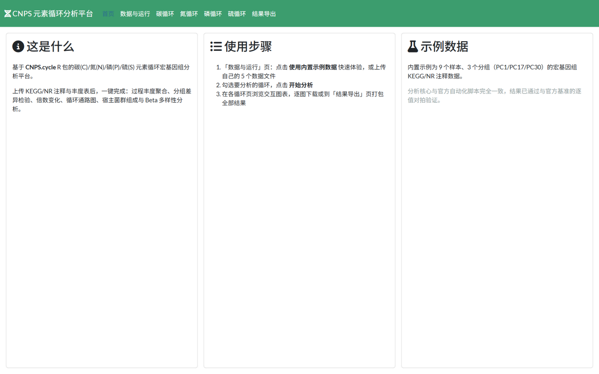
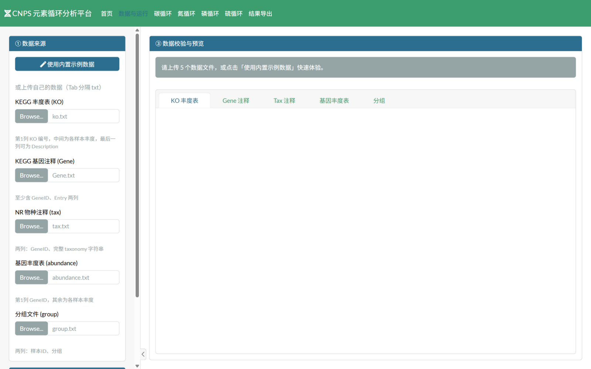
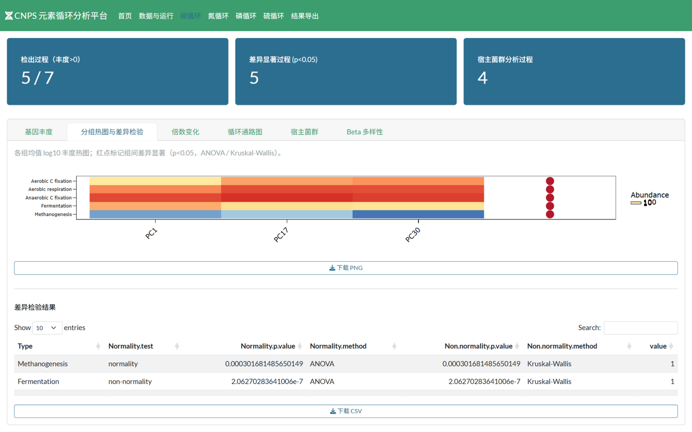
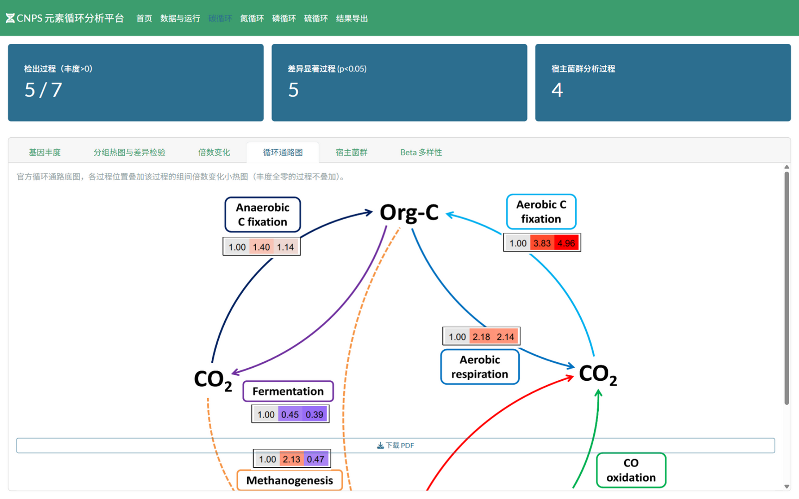

# CNPS 元素循环分析平台 (CNPS Element Cycle Analysis Platform)

[](https://www.r-project.org/)
[](https://shiny.posit.co/)
[](LICENSE)

一个把 **[CNPS.cycle](https://github.com/yuezhengfu/CNPS.cycle)** R 包的碳(C)/氮(N)/磷(P)/硫(S)
元素循环宏基因组分析流程封装成本地 **Shiny** 应用的项目：

> 上传 KEGG/NR 注释与丰度表（或一键使用内置示例数据）→ 校验与预处理 →
> 运行分析 → 交互式浏览结果 → 打包导出。**全程本地运行、离线可用。**

| 首页 | 数据与运行 |
| --- | --- |
|  |  |

| 分组热图与差异检验 | 循环通路图 |
| --- | --- |
|  |  |

## 功能特性

- **一键全流程**：过程丰度聚合 → 分组热图与差异检验（t-test / Wilcoxon / ANOVA / Kruskal-Wallis）→ 倍数变化 → 循环通路合成图 → 宿主菌群组成（门/纲/目/科/属/种六级）→ Beta 多样性（PCoA / PCA / NMDS + Adonis / ANOSIM / MRPP）
- **交互式图表**：热图与排序图基于 plotly 可缩放悬停；表格基于 DT 可搜索排序
- **逐图下载**：PNG / PDF / CSV；或按官方 `Results/` 目录结构一键打包 zip
- **内置示例数据**：9 个样本、3 个分组，点击即可复现完整分析
- **数据校验**：上传时即校验列结构与样本 ID 一致性，预处理与官方脚本逐行一致
- **结果可信**：核心输出已与官方自动化脚本基准**逐值对拍验证**（见下文）

## 快速开始

### 环境要求

- R >= 4.2（Windows 建议 UCRT 版）
- 已安装 [CNPS.cycle](https://github.com/yuezhengfu/CNPS.cycle) 及其依赖、
  以及 `shiny bslib DT plotly shinyjs shinybusy data.table zip` 等
  （安装 CNPS.cycle 后缺什么装什么即可）

```r
# 安装 CNPS.cycle（二选一）
remotes::install_github("yuezhengfu/CNPS.cycle")
# 或本地安装官方 zip 后：
install.packages("CNPS.cycle_1.0.1.zip", repos = NULL)
```

### 启动

```r
shiny::runApp("path/to/CNPS.ShinyApp", port = 3838)
```

Windows 下也可以双击 **`launch_app.bat`**（自动探测 R 安装位置，
找不到时按脚本内注释把 `RSCRIPT` 改成你的 Rscript.exe 路径）。

> 中文界面提示：Windows 下建议以 UTF-8 本地编码启动
> （bat 中已设置 `LC_CTYPE=.UTF-8`），否则中文可能乱码。

## 使用步骤

1. **数据与运行** 页：点击「使用内置示例数据」快速体验；或上传 5 个 Tab 分隔的
   txt 文件（`ko.txt` / `Gene.txt` / `tax.txt` / `abundance.txt` / `group.txt`）。
   输入格式与 [CNPS.cycle 官方示例数据](https://github.com/yuezhengfu/CNPS.cycle) 一致。
2. 勾选要分析的循环（默认全部四个），点击「开始分析」。
3. 在 碳/氮/磷/硫 循环页浏览六个子页：基因丰度、分组热图与差异检验、
   倍数变化、循环通路图、宿主菌群、Beta 多样性。
4. **结果导出** 页：一键打包全部结果（zip），目录结构与官方脚本一致。

## 正确性验证

仓库自带 `smoke_test.R`：完整跑一遍四循环，并在官方基准输出可用时**逐值对拍**
（丰度表、差异检验 p 值、fold change、Bray-Curtis 距离、PCoA 坐标、宿主菌群各级表，
容差 1e-6；各循环宿主分析过程数 C 4 / N 12 / P 2 / S 11 与基准一致）。
没有基准数据时自动降级为结构校验，可在任何环境运行：

```r
set LC_CTYPE=.UTF-8 & Rscript smoke_test.R
```

NMDS 采用随机起点的迭代算法，管道内已固定种子（`set.seed(123)`）保证可复现；
其坐标不参与对拍（基准运行的随机态不可复现），只验证有限性与 stress。

## 实现要点

CNPS.cycle 包的取数机制比较特殊（已通过源码审查 + 运行实验双重验证）：
`Ccyc/Ncyc/Pcyc/Scyc.abundance` 与全部 42 个宿主分析函数**无视形参**，
按变量名从调用环境链中解析 `ko/Gene/tax/abundance`。本项目的适配层
（`R/02_pipeline.R`）在调用前把预处理数据 `assign()` 到 `globalenv` 的精确
变量名上、调用后立即清理，并用互斥状态防止并发运行互相污染；
同时提供包内缺失的 `cbbPalette`。官方脚本的两个已知小缺陷
（碳循环宿主可视化标志索引错位、tax 截断使用 `paste` 引入多余空格）
也在应用层规避，未修改包源码。

## 目录结构

```
├── app.R              入口（UI + server）
├── launch_app.bat     Windows 双击启动器
├── smoke_test.R       冒烟测试（含与官方基准的对拍）
├── www/styles.css     主题样式
├── docs/              截图
└── R/
    ├── 00_config.R    四循环配置表（过程标签 / 通路图坐标 / 宿主函数 / KO 清单）
    ├── 01_data_io.R   读取、校验、预处理
    ├── 02_pipeline.R  核心适配层（全局变量绑定 + run_cycle + 结果导出）
    ├── 03_plots.R     通路合成图 / 宿主图 / 排序图 / 导出图表
    ├── mod_upload.R   数据上传与运行控制模块
    └── mod_cycle.R    循环结果页模块（C/N/P/S 复用）
```

## 致谢与许可

- 分析核心基于 [CNPS.cycle](https://github.com/yuezhengfu/CNPS.cycle)
  （Yue Zhengfu et al.），遵循其 [Apache-2.0](LICENSE) 许可。
- 本项目的封装代码同样以 Apache-2.0 发布。
